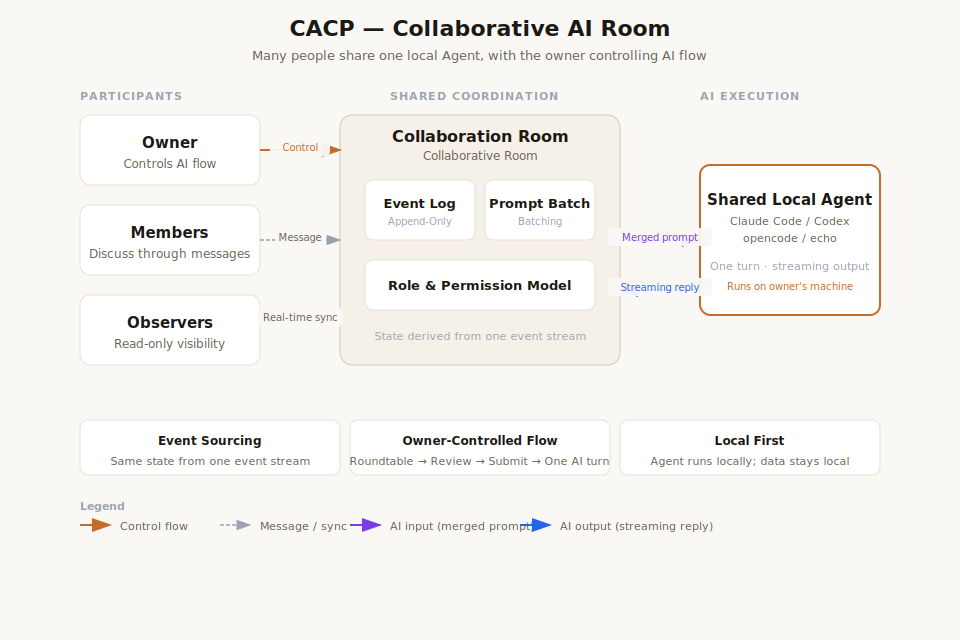

# CACP — Collaborative Agent Communication Protocol

[中文版本](./README.zh-CN.md) · [Live Experience](https://cacp.zuchongai.com/)

## Vision

CACP is an experiment toward a new AI interaction standard built for multi-person systems. Instead of treating AI as a private one-person chat box, CACP explores shared rooms where multiple humans and one or more agents can discuss, coordinate, decide, and execute through the same event stream.

The goal is to make AI collaboration protocol-first: clients, servers, local connectors, and agent tools should be able to interoperate around common room, role, message, event, and control-flow semantics.

<p align="center">
  
</p>

## What Is CACP?

CACP, short for **Collaborative Agent Communication Protocol**, is a local-first reference platform and protocol layer for collaborative AI rooms. It currently includes:

- a browser-based room for humans to create, join, invite, and discuss;
- a Fastify/WebSocket room server backed by an append-only event log;
- a shared protocol package with TypeScript and Zod schemas;
- a local CLI adapter that can connect tools such as Claude Code, Codex, opencode, or an echo test agent;
- **AI Flow Control**, where the room owner can collect multiple participant messages and submit one consolidated agent turn.

The live demo is available at: **https://cacp.zuchongai.com/**

## User Manual

### 1. Start from the live experience

Open `https://cacp.zuchongai.com/`. Use the public demo for evaluation only; do not enter production secrets, private tokens, or sensitive company data.

### 2. Create a room

Choose **Create Room**, enter a room name and your display name, then select an agent type and permission level. Prefer `read_only` when evaluating a real CLI agent for the first time.

### 3. Connect a local agent

In cloud mode, download the Local Connector from the UI and copy the generated connection code. The connector bridges the hosted room to a CLI agent running on your own machine. Closing the connector window disconnects the local agent.

### 4. Invite collaborators

Room owners can create invite links from the sidebar. Use `member` for active collaborators and `observer` for read-only viewers. Owners can approve join requests, remove participants, and clear room history.

### 5. Collaborate with AI Flow Control

Use normal live chat for quick turns. When several people need to contribute before the AI responds, the owner can switch to collection mode, gather participant messages, review them, and submit a single merged prompt to the active agent.

### 6. Manage the agent

The room sidebar shows agent status, active agent selection, capabilities, and management controls. If an agent is offline, reconnect the local connector or start a new pairing flow.

## Developer Manual

### Repository layout

```text
packages/protocol     Shared event schemas, types, and protocol contracts
packages/server       Fastify/WebSocket server, auth, pairing, event store
packages/cli-adapter  Local CLI connector and runner logic
packages/web          React + Vite web room UI
docs/                 Protocol docs, diagrams, examples, deployment notes
scripts/              Build and utility scripts
```

### Requirements

Use Node.js 20+, Corepack, and the pinned pnpm version declared in `package.json`.

```powershell
corepack enable
corepack pnpm install
```

### Common commands

```powershell
corepack pnpm check        # run tests, then build all packages
corepack pnpm test         # build protocol, then run Vitest recursively
corepack pnpm build        # build every workspace package
corepack pnpm dev:server   # run API/WebSocket server on 127.0.0.1:3737
corepack pnpm dev:web      # run Vite web UI on 127.0.0.1:5173
corepack pnpm dev:adapter  # run the generic local CLI adapter example
```

For focused package work:

```powershell
corepack pnpm --filter @cacp/server test
corepack pnpm --filter @cacp/web test
```

### Local development flow

1. Start the server with `corepack pnpm dev:server`.
2. Start the web UI with `corepack pnpm dev:web`.
3. Create a room in the browser.
4. Copy an example adapter config from `docs/examples/*.json` to an ignored `.local.json` file.
5. Run `corepack pnpm dev:adapter` to connect a local agent.

On Windows, `start-test-services.ps1` and `start-test-services.cmd` can start or restart background test services. Runtime logs and generated adapter launch scripts are written to `.tmp-test-services/`.

### Protocol development

The protocol is event-sourced. Add new behavior by defining an event contract first, then deriving state from events. When changing event types or payloads, update:

- `packages/protocol/src/schemas.ts`;
- server-side derivation and route behavior in `packages/server/src/*`;
- web room-state derivation in `packages/web/src/room-state.ts`;
- tests and protocol documentation under `docs/protocol/`.

### Security and configuration

Never commit `.env`, `.deploy/*`, `docs/Server info.md`, local connector configs, SQLite databases, SSH keys, participant tokens, invite tokens, pairing codes, or production configuration. The public demo is for testing the interaction model, not for sensitive workloads.

## Contact

For feedback, collaboration, or deployment questions, contact:

- 453043662@qq.com
- wangzuchong@gmail.com
- 1023289914@qq.com
