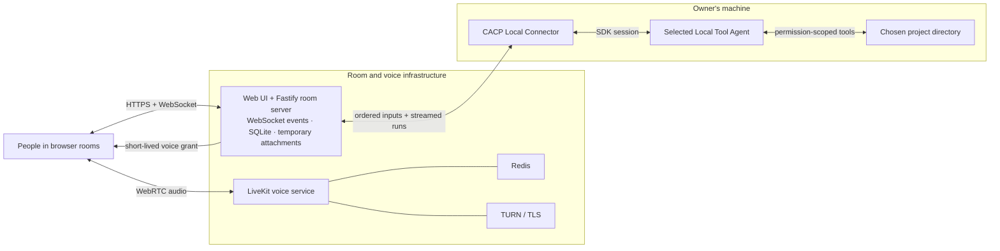

# CACP

[English](README.md) | [简体中文](README.zh-CN.md)

[](https://github.com/Wallisking1991/CACP/actions/workflows/ci.yml)


[](LICENSE)

**A local-first collaborative room where people work with locally running AI
agents—together, in real time.**

CACP stands for **Collaborative Agent Communication Protocol**. It combines a
shared web room, a protocol-first room server, and a Local Connector that keeps
AI agent execution on the owner's machine.

[Try the live demo](https://cacp.zuchongai.com/) ·
[Run locally](#run-locally) · [Explore the architecture](#how-it-works) ·
[Contribute](CONTRIBUTING.md)

> **Experimental / Developer Preview.** CACP is ready to try, study, and
> contribute to, but it is not production-ready. Use the public demo only with
> non-sensitive test content and test projects.


## Contents

- [Why CACP](#why-cacp)
- [What works today](#what-works-today)
- [How it works](#how-it-works)
- [Try CACP](#try-cacp)
- [Run locally](#run-locally)
- [Voice infrastructure](#voice-infrastructure)
- [Security model](#security-model)
- [Project status](#project-status)
- [Repository layout](#repository-layout)
- [Contributing](#contributing)

## Why CACP

Most AI tools assume one person talking to one agent. Real work is often more
social: product decisions, requirements, reviews, planning, and creative work
need several people to build shared context before asking an AI to act.

CACP adds that missing collaboration layer. People can talk in a shared room,
develop ideas in an Orbit Discussion or Collaborative Whiteboard, and then
explicitly turn selected context into an ordered input for a locally running AI
agent. The room coordinates the work; the Local Connector executes it in the
project directory and permission scope chosen by the owner.

## What works today

| Capability               | Current implementation                                                                                                                         |
| ------------------------ | ---------------------------------------------------------------------------------------------------------------------------------------------- |
| Shared Live Rooms        | Real-time rooms with owner, admin, member, observer, and Agent roles; controlled invites and join approval.                                    |
| Local Tool Agents        | Claude Code, Codex CLI, GitHub Copilot CLI, and Kimi Code through one cross-platform Local Connector.                                          |
| Deliberate AI turns      | Main Inputs are processed in FIFO order. Each input triggers one turn from the selected Agent.                                                 |
| Orbit Discussion         | A human-only side conversation with notes, replies, reactions, attachments, and explicit promotion into a Main Input.                          |
| Collaborative Whiteboard | One real-time Excalidraw workspace per Live Room, with presence, temporary snapshots, image assets, export, and explicit delivery to an Agent. |
| Voice                    | Optional LiveKit voice rooms with microphone controls, device checks, speaking state, and listen-only observers.                               |
| Attachments              | Verified images, PDFs, text/source files, and Office documents with capability negotiation and per-Agent download grants.                      |
| Agent visibility         | Streaming output, run status, tool/work nodes, queue state, and fresh or resumable native Agent sessions where supported.                      |

The Local Connector supports three permission levels: `read_only`,
`limited_write`, and `full_access`. Attachment delivery is also adapter-aware:
the room validates the selected Agent's declared native-input and file-path
capabilities before dispatch.

## How it works


```mermaid
flowchart LR
  People["People in browser rooms"]

  subgraph Public["Room and voice infrastructure"]
    Room["Web UI + Fastify room server<br/>WebSocket events · SQLite · temporary attachments"]
    LiveKit["LiveKit voice service"]
    Redis["Redis"]
    Turn["TURN / TLS"]
  end

  subgraph Owner["Owner's machine"]
    Connector["CACP Local Connector"]
    Agent["Selected Local Tool Agent"]
    Project["Chosen project directory"]
  end

  People <-->|"HTTPS + WebSocket"| Room
  Room <-->|"ordered inputs + streamed runs"| Connector
  Connector <-->|"SDK session"| Agent
  Agent <-->|"permission-scoped tools"| Project
  Room -->|"short-lived voice grant"| People
  People <-->|"WebRTC audio"| LiveKit
  LiveKit --- Redis
  LiveKit --- Turn
```

The server owns room identity, authorization, the append-only event model,
queueing, Orbit state, whiteboard coordination, and temporary Room
Attachments. The Local Connector owns the bridge to the Agent SDK and the
selected local working directory.

“Local-first” describes the **Agent execution boundary**. Shared room content,
events, and attachments still pass through the room server, and voice media
passes through the configured LiveKit infrastructure. CACP does not claim that
all collaboration data stays on one machine.

## Try CACP

1. Open the [live demo](https://cacp.zuchongai.com/), enter your name, and
   create a room.
2. Choose a supported Local Tool Agent and a permission level. Start with
   **Read only** for a first test.
3. Download the Local Connector, extract it into the project directory the
   Agent may access, and start it:
   - Windows: `Start.bat`
   - macOS: `Start.command`
   - Linux: `start.sh`
4. Paste the room connection code into the Connector window, then choose a
   fresh or detected Agent session.
5. Invite trusted teammates. Use Orbit for human discussion, promote selected
   notes when they are ready, or send a Main Input directly to the Agent.

The Connector runs a diagnostic before starting. You can also run
`Doctor.bat`, `Doctor.command`, or `doctor.sh` manually if an Agent is not
detected.

> **Safety first:** a Local Tool Agent may read or modify files within the
> chosen working directory according to its permission level. The public demo
> is experimental; do not use production repositories, secrets, private keys,
> confidential documents, or sensitive room content.

## Run locally

### Prerequisites

- Node.js 22.12 or newer; Node.js 24 is recommended
- Corepack and the repository-pinned pnpm version
- A supported Agent installation and its normal provider authentication if you
  want to connect a real Agent

Install the workspace:

```shell
corepack enable
corepack pnpm install
```

Start the server and web app in separate terminals:

```shell
corepack pnpm dev:server
```

```shell
corepack pnpm dev:web
```

Open <http://127.0.0.1:5173/>. Local deployment mode can launch the Connector
from the room flow; connector developers can instead configure a local adapter
example and run:

```shell
corepack pnpm dev:adapter
```

Useful validation commands:

```shell
corepack pnpm test
corepack pnpm build
corepack pnpm validate
```

Run focused tests by package when iterating:

```shell
corepack pnpm --filter @cacp/server test
corepack pnpm --filter @cacp/web test
corepack pnpm --filter @cacp/cli-adapter test
```

Build the cross-platform Connector bundle with:

```shell
corepack pnpm package:connector
```

## Voice infrastructure

Voice is optional. The room server enables it only when `LIVEKIT_URL`,
`LIVEKIT_API_KEY`, and `LIVEKIT_API_SECRET` are configured together. It issues
short-lived room grants, allows owners/admins/members to publish microphone
audio, restricts observers to listening, and removes participants or voice
rooms when the corresponding CACP state ends.

A production voice deployment also needs a publicly reachable LiveKit service,
valid TLS, and WebRTC network traversal. The current reference topology uses a
separate LiveKit service with Redis plus TURN/TLS configuration; these are
deployment infrastructure, not part of the Local Connector. Keep LiveKit
secrets and production topology out of the repository.

## Security model

CACP has a deliberately narrow local execution boundary, but it is not an
end-to-end encrypted or production-hardened platform.

- The Local Tool Agent runs on the Connector owner's machine, inside the chosen
  working directory and configured permission level.
- Room events and shared content are visible to authorized room participants.
  Treat invite links, connection codes, and participant tokens as credentials.
- Imported native Agent history becomes shared room content after the owner
  previews and confirms it.
- Room Attachments are temporary. Each file is limited to 10 MiB, each input to
  five files, and a room to a default 50 MiB quota.
- Orbit attachments remain human-visible without being disclosed to an Agent.
  Promotion creates an explicit grant only for the Agent targeted by that Main
  Input.
- Attachment bytes are deleted when they lose all room references, when the
  owner ends the Live Room, or when the room server restarts. They are not a
  permanent file library.
- Only expose the web UI and room server publicly. Agent execution stays behind
  the Local Connector.

See [SECURITY.md](SECURITY.md) for private vulnerability reporting.

## Project status

| Item                | Status                                                                   |
| ------------------- | ------------------------------------------------------------------------ |
| Product maturity    | Experimental / Developer Preview                                         |
| Workspace version   | 0.5.0                                                                    |
| Wire protocol       | CACP 0.3.0                                                               |
| Room lifetime       | Temporary; a room ends when its owner leaves or the room server restarts |
| Supported Agents    | Claude Code, Codex CLI, GitHub Copilot CLI, and Kimi Code                |
| HTTP LLM API Agents | Not supported by the current mainline                                    |

### What CACP is not

- It is not a hosted coding-agent platform; Agent execution stays on the
  Connector owner's machine.
- It is not a replacement for Claude Code, Codex, Copilot, or Kimi; it provides
  the collaboration layer around them.
- It is not production-ready collaboration infrastructure.

## Repository layout

| Path                                           | Responsibility                                                                                                                       |
| ---------------------------------------------- | ------------------------------------------------------------------------------------------------------------------------------------ |
| [`packages/protocol`](packages/protocol)       | Shared TypeScript types, Zod schemas, policy logic, compatibility manifests, and wire contracts.                                     |
| [`packages/server`](packages/server)           | Fastify/WebSocket API, SQLite event store, auth, pairing, room governance, attachments, whiteboard coordination, and LiveKit grants. |
| [`packages/cli-adapter`](packages/cli-adapter) | Cross-platform Local Connector and SDK runtimes for the four supported Local Tool Agents.                                            |
| [`packages/web`](packages/web)                 | React/Vite room UI, state projection, Orbit, attachments, voice, and Collaborative Whiteboard.                                       |
| [`docs`](docs)                                 | Protocol notes, ADRs, diagnostics, research, and design history.                                                                     |

Useful starting points:

- [Protocol v0.3](docs/protocol/cacp-v0.3.md)
- [Domain vocabulary](CONTEXT.md)
- [Architecture decisions](docs/adr)
- [Collaboration diagnostics](docs/collaboration-diagnostics.md)
- [Contribution guide](CONTRIBUTING.md)

## Contributing

Contributions are welcome in protocol design, room UX, Local Connector
reliability, Agent compatibility, whiteboard and voice behavior, accessibility,
security hardening, tests, and documentation.

Before opening a pull request, run `corepack pnpm validate`. Include validation
notes and screenshots for user-visible changes, and call out protocol,
security, deployment, or connector risk. See [CONTRIBUTING.md](CONTRIBUTING.md)
for the full workflow.

## Contact

- 453043662@qq.com
- wangzuchong@gmail.com
- 1023289914@qq.com

Report security issues privately as described in [SECURITY.md](SECURITY.md).

## License

Licensed under the [Apache License 2.0](LICENSE).
