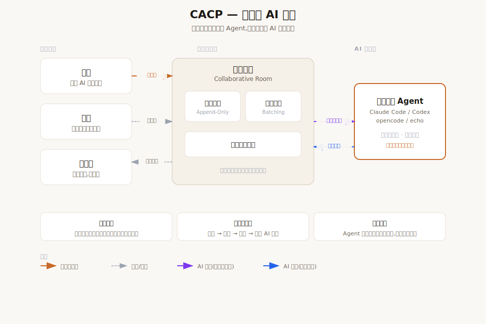

# CACP

**状态：** 实验性项目  
**在线体验：** https://cacp.zuchongai.com/  
**English:** [README.md](README.md)

CACP 的全称是 Collaborative Agent Communication Protocol，我把它称为协同式智能体通信协议。

这个项目来自一个很简单的理念：下一阶段的 AI 工具，不应该只让一个人变得更强，也应该帮助多个人、AI Agent、工具和共享上下文在同一个协作空间里共同工作。

现在大多数 AI 和 AI Agent 产品，默认仍然是一个人和一个 AI 对话。这个模式已经非常有价值，但现实世界里很多高价值问题并不是一个人独立解决的。产品设计、软件需求、开源项目规划、安全评审、业务决策和创意讨论，往往都需要不同专业背景的人先形成共同上下文，然后 AI 才能基于更完整的信息给出高质量结果。

CACP 是对这层多人 AI 协作协议的开源探索。它提供一个共享 AI 房间，让多个人可以一起讨论，邀请成员或观察者，接入本地或 API 形式的 Agent，并通过圆桌模式先收集人的多视角观点，再统一提交给 AI。

这是一个早期开源原型和协议实验。核心体验已经可以运行，适合试用、研究和贡献，但它还不是生产级协作平台。



## CACP 是什么？

CACP 是一个本地优先的多人协作 AI 房间。公共服务器只承载房间状态和 Web UI；智能体执行仍然通过本地连接器在用户机器上完成。

它包含：

- 一个 Web 房间，支持多个人进入同一个 AI 对话上下文。
- 一个房间服务，用事件日志保存状态，并通过 WebSocket 实时广播。
- 一个本地连接器，用来把 Web 房间连接到持久化 Claude Code 会话或 LLM API Agent。
- 一个协议包，定义共享事件类型、参与者角色、连接码和房间契约。
- 一个圆桌模式，让人先充分讨论，再由房主把本轮收集到的上下文统一提交给 AI。

本地执行以 Claude Code 为核心：

- Claude Code 通过本地连接器运行在房主选择的项目目录中。
- 连接器可以开启新会话，也可以恢复检测到的 Claude Code 会话。
- 只有房主确认后，恢复的 Claude Code 会话历史才会上传到共享房间时间线。
- 导入的 Claude Code 历史对所有房间成员可见，应视为共享房间内容。

LLM API 智能体仍然保留，适用于纯对话场景。API Key 只保存在本地连接器中，并在配对前进行连通性验证。

## 面向谁？

CACP 面向两类人。

### 普通用户

如果你想体验一个多人 AI 讨论房间，让几个人在同一个上下文里和 AI 一起讨论问题，可以尝试 CACP。

可能的使用场景包括：

- 多人一起进行产品创意头脑风暴。
- 业务人员和技术人员一起讨论软件需求。
- 从不同专业视角设计一个游戏、应用或创意项目。
- 让观察者学习一个 AI 辅助项目讨论是如何展开的。
- 测试本地 CLI Agent 或 LLM API Agent 在共享房间里的表现。

### 开发者

如果你想研究或贡献一个 protocol-first、local-first 的 AI 协作实验项目，可以从 CACP 的代码和协议开始。

可以参与的方向包括：

- 房间协议和事件模型。
- Fastify 和 WebSocket 房间服务。
- SQLite 事件存储。
- React + Vite 房间界面。
- 本地连接器和 CLI Agent 适配器。
- LLM API Provider 适配器。
- 邀请、配对、参与者和房间治理流程。

## 在线体验

打开：

https://cacp.zuchongai.com/

在线体验环境是公开的，也是实验性的。请只用于非敏感话题和测试项目。

## 普通用户使用说明

### 1. 创建房间

打开在线体验地址，选择创建房间。

你需要填写：

- 房间名称。
- 你的显示名称。
- 希望接入的 Agent 类型。
- 如果选择本地 CLI Agent，还需要选择权限级别。

### 2. 选择 Agent 类型

CACP 可以接入不同类型的 Agent。

本地 CLI Agent：

- Claude Code

LLM API Agent：

- OpenAI 兼容接口
- Anthropic 兼容接口
- 一些模型服务商适配器，例如 DeepSeek、Kimi、MiniMax、SiliconFlow、GLM 等

LLM API 连接器支持多个服务商适配器，例如 DeepSeek、Kimi、MiniMax、SiliconFlow、GLM 等。

### 3. 下载并启动 Local Connector

在云端体验模式下，浏览器房间不能直接运行你的本地 Agent，因此需要 Local Connector，也就是本地连接器。

创建房间后，页面会提示下载连接器。

建议：

- 把连接器放在你希望 Agent 工作的目录里。
- 第一次体验时，优先使用测试目录或非敏感项目。
- 不要把生产仓库、密钥文件、私钥或机密文档作为测试目录。

启动连接器后，把 Web 房间里显示的 CACP 连接码复制并粘贴到连接器窗口里。

使用房间时请保持连接器窗口打开。关闭它会断开本地 Agent。

### 4. 连接 LLM API Agent

如果你选择 LLM API Agent，连接器会在本地询问 Provider、Base URL、模型名称和 API Key 等信息。

这些配置用于本地连接器。请不要在房间消息、截图、Issue、日志或公开讨论里暴露 API Key。

### 5. 邀请成员或观察者

房主可以创建邀请链接。

角色说明：

- Owner：房主，管理房间，审批加入请求，启动和提交圆桌模式，管理参与者。
- Member：成员，可以参与讨论和发送消息。
- Observer：观察者，只能查看房间内容，不参与对话。
- Agent：接入房间的 AI 参与者。

邀请链接应当被视为访问凭证。只分享给你信任的人。

### 6. 使用普通聊天

在普通聊天模式下，消息会发送到房间，并可以触发当前 Active Agent 回复。

这个模式适合需要 AI 立即反馈的场景。

### 7. 使用圆桌模式

圆桌模式是 CACP 当前最核心的交互模式。

当你希望先让多人充分讨论，再让 AI 基于大家的讨论统一回答时，可以使用圆桌模式。

典型流程：

1. 房主启动圆桌模式，或者成员申请圆桌模式后由房主批准。
2. 参与者在房间里从各自视角补充观点。
3. 这些消息会被收集起来，不会逐条触发 AI。
4. 房主提交本轮圆桌讨论。
5. Agent 收到这一轮收集到的人类上下文，并统一回复一次。

这个模式适合产品设计、架构讨论、业务分析、需求澄清、创意头脑风暴等需要多视角输入的场景。

## 普通用户安全边界

CACP 采用 local-first 的 Agent 边界设计，但用户仍然需要谨慎使用。

重要提醒：

- 在线体验环境是实验性的，不要用于机密工作。
- 本地 CLI Agent 运行在你的电脑上，可能访问你选择的工作目录。
- 公开演示时建议优先使用只读权限，除非你明确希望 Agent 修改文件。
- 不要在聊天、截图或日志里暴露 token、API Key、SSH Key、生产配置、私有房间链接或敏感文件。
- 只在你信任的目录中连接 Agent。
- 只邀请你信任的人进入包含有意义上下文的房间。
- 如果不确定安全边界，建议使用 LLM API Agent 或测试目录，而不是给本地代码 Agent 写入权限。

## CACP 不是什么

CACP 不是一个托管式代码 Agent 平台。

CACP 不是 Claude Code 或其他 Agent 的替代品。

CACP 还不是生产级协作基础设施。

CACP 是一个早期开源实验，用来探索多个人类和 AI Agent 如何通过共享协议和共享房间进行沟通。

## 项目结构

```text
packages/
  protocol      共享 TypeScript 类型、Zod schema、协议契约、连接码
  server        Fastify/WebSocket 房间服务、SQLite 事件存储、认证、配对、治理
  cli-adapter   本地连接器，以及 CLI Agent 和 LLM API Agent 的运行逻辑
  web           React + Vite 房间界面

docs/
  protocol      协议说明
  examples      连接器配置示例
  superpowers   设计和实现记录

deploy/
  示例生产部署文件

scripts/
  仓库工具，例如 Windows Local Connector 构建脚本
```

## 本地开发

前置要求：

- Node.js 20 或更高版本
- Corepack
- 使用 `packageManager` 中固定的 pnpm 版本

安装依赖：

```powershell
corepack enable
corepack pnpm install
```

运行完整验证：

```powershell
corepack pnpm check
```

运行测试：

```powershell
corepack pnpm test
```

构建所有包：

```powershell
corepack pnpm build
```

启动本地开发服务：

```powershell
corepack pnpm dev:server
corepack pnpm dev:web
corepack pnpm dev:adapter
```

运行单个包的测试：

```powershell
corepack pnpm --filter @cacp/server test
corepack pnpm --filter @cacp/web test
corepack pnpm --filter @cacp/cli-adapter test
```

构建 Windows Local Connector 可执行文件：

```powershell
corepack pnpm build:connector:win
```

## 开发者说明

重要文件：

- 协议 schema：`packages/protocol/src/schemas.ts`
- 连接码工具：`packages/protocol/src/connection-code.ts`
- 服务端应用和路由：`packages/server/src/server.ts`
- 事件存储：`packages/server/src/event-store.ts`
- 服务端对话辅助逻辑：`packages/server/src/conversation.ts`
- Agent profile 映射：`packages/server/src/pairing.ts`
- Web API 客户端：`packages/web/src/api.ts`
- Web 房间状态派生：`packages/web/src/room-state.ts`
- CLI Adapter 入口：`packages/cli-adapter/src/index.ts`
- LLM Provider Registry：`packages/cli-adapter/src/llm/providers/registry.ts`

如果修改协议事件契约，通常需要同步更新：

- 协议 schema。
- 服务端创建或派生该事件的逻辑。
- Web 房间状态派生。
- 相关包测试。
- 如果行为对用户可见，还需要更新文档。

## 开发者安全边界

只有房间服务和 Web UI 应该公开部署。

Agent 执行应当通过连接器留在用户本地。

不要提交：

- `.env`
- `.deploy/*`
- `docs/Server info.md`
- `docs/deploy-cloud.md`
- `docs/examples/*.local.json`
- SQLite 数据库文件
- SSH Key
- API Key
- 生产配置
- connector token
- 包含房间、邀请、配对、参与者或连接器秘密的截图和日志

## 参与贡献

欢迎贡献，尤其是这些方向：

- 协议设计和事件语义。
- 房间体验和圆桌模式改进。
- Local Connector 易用性。
- Agent 适配兼容性。
- LLM Provider 适配器。
- 安全审查和加固。
- 文档和示例。

提交 Pull Request 前，请运行相关测试，并在 PR 中说明验证命令。涉及可见 UI 的改动，建议附上截图或录屏。

## 联系方式

项目联系邮箱：

- 453043662@qq.com
- wangzuchong@gmail.com
- 1023289914@qq.com

