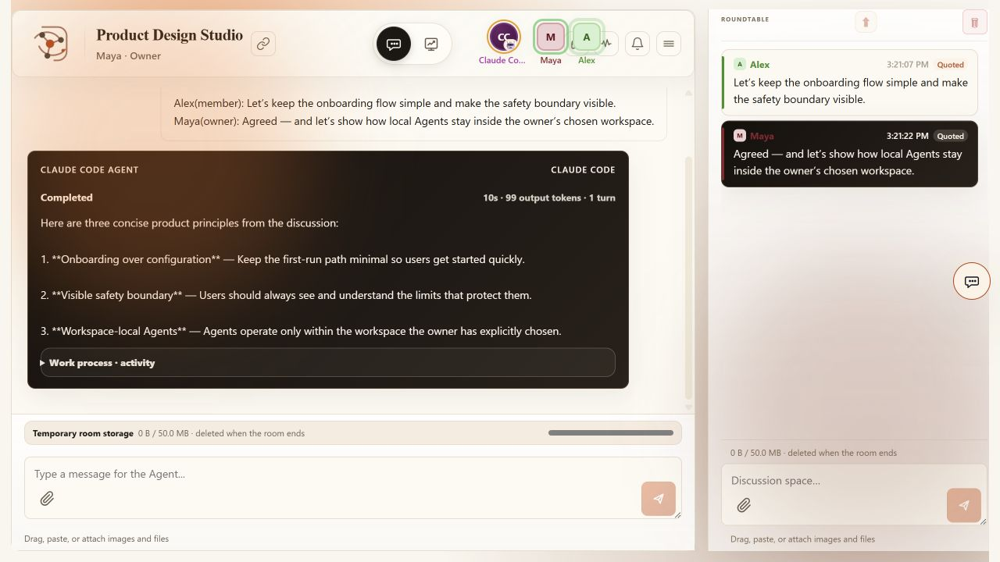
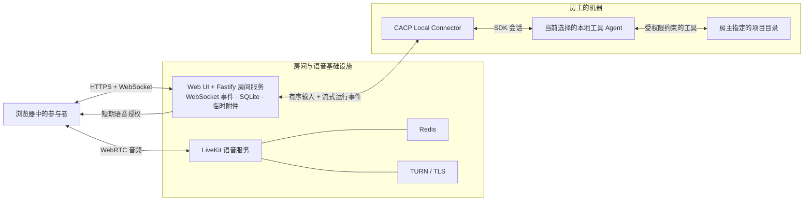

# CACP

[English](README.md) | [简体中文](README.zh-CN.md)

[](https://github.com/Wallisking1991/CACP/actions/workflows/ci.yml)


[](LICENSE)

**一个让多人和本地运行的 AI Agent 实时协作的本地优先共享空间。**

CACP 全称为 **Collaborative Agent Communication Protocol（协作式 Agent
通信协议）**。它由共享 Web 房间、协议优先的房间服务端和 Local Connector
组成；AI Agent 始终在房主自己的机器上执行。

[体验在线演示](https://cacp.zuchongai.com/) ·
[本地运行](#本地运行) · [了解架构](#工作原理) ·
[参与贡献](CONTRIBUTING.md)

> **实验性开发者预览。** CACP 的核心体验已经可以运行，适合试用、研究和参与
> 开发，但尚未达到生产可用标准。请只用非敏感测试内容和测试项目体验公开演示。



## 目录

- [为什么需要 CACP](#为什么需要-cacp)
- [当前已经实现](#当前已经实现)
- [工作原理](#工作原理)
- [在线体验](#在线体验)
- [本地运行](#本地运行)
- [语音基础设施](#语音基础设施)
- [安全模型](#安全模型)
- [项目状态](#项目状态)
- [仓库结构](#仓库结构)
- [参与贡献](#参与贡献)

## 为什么需要 CACP

大多数 AI 工具默认一个人与一个 Agent 对话，但真实工作往往需要多人协作。产品
决策、需求讨论、代码审查、项目规划和创意工作，都需要不同角色先建立共同上下文，
再让 AI 采取行动。

CACP 补上了这一层协作能力。参与者可以在共享房间里沟通，在 Orbit Discussion
或 Collaborative Whiteboard 中形成想法，再明确选择哪些上下文要成为本地 AI
Agent 的有序输入。房间负责协调协作过程，Local Connector 则在房主指定的项目
目录和权限范围内执行 Agent。

## 当前已经实现

| 能力                     | 当前实现                                                                                            |
| ------------------------ | --------------------------------------------------------------------------------------------------- |
| 共享 Live Room           | 支持房主、管理员、成员、观察者和 Agent 角色的实时房间，并提供受控邀请和加入审批。                   |
| 本地工具 Agent           | 通过同一个跨平台 Local Connector 连接 Claude Code、Codex CLI、GitHub Copilot CLI 和 Kimi Code。     |
| 明确的 AI 回合           | Main Input 按 FIFO 顺序处理，每个输入只触发所选 Agent 的一个回合。                                  |
| Orbit Discussion         | 人类专用的侧边讨论区，支持笔记、回复、反应、附件，以及显式提升为 Main Input。                       |
| Collaborative Whiteboard | 每个 Live Room 一块实时 Excalidraw 白板，支持在线状态、临时快照、图片素材、导出和显式发送给 Agent。 |
| 语音                     | 可选的 LiveKit 语音房间，包含麦克风控制、设备检测、发言状态和观察者只听模式。                       |
| 附件                     | 对图片、PDF、文本/源码文件和 Office 文档进行校验，并协商 Agent 输入能力和单 Agent 下载授权。        |
| Agent 过程可见性         | 展示流式输出、运行状态、工具/工作节点和输入队列；在底层 Agent 支持时可新建或恢复原生会话。          |

Local Connector 提供 `read_only`、`limited_write` 和 `full_access` 三种
权限等级。附件投递也会感知适配器能力：房间会在派发前校验所选 Agent 声明的
原生输入或本地文件路径能力。

## 工作原理


```mermaid
flowchart LR
  People["浏览器中的参与者"]

  subgraph Public["房间与语音基础设施"]
    Room["Web UI + Fastify 房间服务<br/>WebSocket 事件 · SQLite · 临时附件"]
    LiveKit["LiveKit 语音服务"]
    Redis["Redis"]
    Turn["TURN / TLS"]
  end

  subgraph Owner["房主的机器"]
    Connector["CACP Local Connector"]
    Agent["当前选择的本地工具 Agent"]
    Project["房主指定的项目目录"]
  end

  People <-->|"HTTPS + WebSocket"| Room
  Room <-->|"有序输入 + 流式运行事件"| Connector
  Connector <-->|"SDK 会话"| Agent
  Agent <-->|"受权限约束的工具"| Project
  Room -->|"短期语音授权"| People
  People <-->|"WebRTC 音频"| LiveKit
  LiveKit --- Redis
  LiveKit --- Turn
```

服务端负责房间身份、授权、追加式事件模型、输入队列、Orbit 状态、白板协调和
临时 Room Attachment。Local Connector 负责连接 Agent SDK 以及房主选择的
本地工作目录。

这里的“本地优先”特指 **Agent 的执行边界**。共享房间内容、事件和附件仍然会
经过房间服务端，语音媒体也会经过所配置的 LiveKit 基础设施。CACP 并不声称
所有协作数据都只停留在一台机器上。

## 在线体验

1. 打开[在线演示](https://cacp.zuchongai.com/)，输入姓名并创建房间。
2. 选择一个受支持的本地工具 Agent 和权限等级。首次体验建议使用
   **Read only（只读）**。
3. 下载并解压 Local Connector，把它放入允许 Agent 访问的项目目录，然后启动：
   - Windows：`Start.bat`
   - macOS：`Start.command`
   - Linux：`start.sh`
4. 在 Connector 窗口粘贴房间连接码，再选择新会话或检测到的 Agent 会话。
5. 邀请可信的协作者。使用 Orbit 进行人类讨论，成熟后提升选中的笔记，或者直接
   向 Agent 发送 Main Input。

Connector 会在启动前运行诊断。如果没有检测到 Agent，也可以手动运行
`Doctor.bat`、`Doctor.command` 或 `doctor.sh`。

> **安全第一：** 本地工具 Agent 可能根据所选权限读取或修改工作目录中的文件。
> 公开演示仍属实验性质，请勿使用生产仓库、密钥、私钥、机密文档或敏感房间内容。

## 本地运行

### 前置条件

- Node.js 22.12 或更高版本，推荐 Node.js 24
- Corepack 和仓库固定版本的 pnpm
- 如果要连接真实 Agent，需要安装受支持的 Agent，并完成其正常的服务商认证

安装工作区依赖：

```shell
corepack enable
corepack pnpm install
```

在两个终端中分别启动服务端和 Web 应用：

```shell
corepack pnpm dev:server
```

```shell
corepack pnpm dev:web
```

打开 <http://127.0.0.1:5173/>。本地部署模式可以从房间流程启动 Connector；
开发 Connector 时，也可以配置一个仅保存在本地的适配器示例，然后运行：

```shell
corepack pnpm dev:adapter
```

常用验证命令：

```shell
corepack pnpm test
corepack pnpm build
corepack pnpm validate
```

开发单个包时可运行聚焦测试：

```shell
corepack pnpm --filter @cacp/server test
corepack pnpm --filter @cacp/web test
corepack pnpm --filter @cacp/cli-adapter test
```

构建跨平台 Connector 压缩包：

```shell
corepack pnpm package:connector
```

## 语音基础设施

语音功能是可选的。只有同时配置 `LIVEKIT_URL`、`LIVEKIT_API_KEY` 和
`LIVEKIT_API_SECRET` 时，房间服务端才会启用语音。服务端签发短期房间授权，
允许房主、管理员和成员发布麦克风音频，将观察者限制为只听，并在相应 CACP
状态结束时移除参与者或删除语音房间。

生产语音部署还需要可公开访问的 LiveKit 服务、有效 TLS 和 WebRTC 网络穿透。
当前参考拓扑使用独立 LiveKit 服务、Redis 以及 TURN/TLS 配置；这些都属于部署
基础设施，不是 Local Connector 的一部分。LiveKit 密钥和生产拓扑不得提交到
仓库。

## 安全模型

CACP 有意收窄了本地执行边界，但它不是端到端加密或已经完成生产加固的平台。

- 本地工具 Agent 在 Connector 房主的机器上运行，并受指定工作目录和权限等级
  限制。
- 房间事件和共享内容对已授权参与者可见。邀请链接、连接码和参与者令牌都应视为
  凭据。
- 房主预览并确认后，导入的原生 Agent 历史会成为房间成员可见的共享内容。
- Room Attachment 是临时数据：单文件不超过 10 MiB，单次输入最多五个文件，
  房间默认总配额为 50 MiB。
- Orbit 附件可以在人类之间共享而不向 Agent 披露。提升操作只会为该 Main Input
  指向的 Agent 创建显式访问授权。
- 附件失去全部房间内容引用、房主结束 Live Room 或房间服务端重启时，附件字节
  都会被删除；它不是永久文件库。
- 只有 Web UI 和房间服务端适合公开暴露；Agent 执行必须保留在 Local Connector
  之后。

私下报告安全问题的方法请参阅 [SECURITY.md](SECURITY.md)。

## 项目状态

| 项目               | 状态                                                    |
| ------------------ | ------------------------------------------------------- |
| 产品成熟度         | 实验性开发者预览                                        |
| 工作区版本         | 0.5.0                                                   |
| 线协议版本         | CACP 0.3.0                                              |
| 房间生命周期       | 临时；房主离开或房间服务端重启时结束                    |
| 支持的 Agent       | Claude Code、Codex CLI、GitHub Copilot CLI 和 Kimi Code |
| HTTP LLM API Agent | 当前主线不支持                                          |

### CACP 不是什么

- 它不是托管式 Coding Agent 平台；Agent 在 Connector 房主的机器上执行。
- 它不是 Claude Code、Codex、Copilot 或 Kimi 的替代品；它提供包围这些工具的
  协作层。
- 它还不是生产级协作基础设施。

## 仓库结构

| 路径                                           | 职责                                                                                          |
| ---------------------------------------------- | --------------------------------------------------------------------------------------------- |
| [`packages/protocol`](packages/protocol)       | 共享 TypeScript 类型、Zod Schema、策略逻辑、兼容性清单和线协议契约。                          |
| [`packages/server`](packages/server)           | Fastify/WebSocket API、SQLite 事件存储、认证、配对、房间治理、附件、白板协调和 LiveKit 授权。 |
| [`packages/cli-adapter`](packages/cli-adapter) | 跨平台 Local Connector，以及四种受支持本地工具 Agent 的 SDK Runtime。                         |
| [`packages/web`](packages/web)                 | React/Vite 房间 UI、状态投影、Orbit、附件、语音和 Collaborative Whiteboard。                  |
| [`docs`](docs)                                 | 协议说明、ADR、诊断文档、研究资料和设计历史。                                                 |

推荐从以下文档开始深入了解：

- [Protocol v0.3](docs/protocol/cacp-v0.3.md)
- [领域词汇](CONTEXT.md)
- [架构决策](docs/adr)
- [协作诊断](docs/collaboration-diagnostics.md)
- [贡献指南](CONTRIBUTING.md)

## 参与贡献

欢迎参与协议设计、房间体验、Local Connector 可靠性、Agent 兼容性、白板与语音
行为、无障碍、安全加固、测试和文档工作。

提交 Pull Request 前请运行 `corepack pnpm validate`。对用户可见的改动应附带验证
说明和截图，并明确协议、安全、部署或 Connector 风险。完整流程请参阅
[CONTRIBUTING.md](CONTRIBUTING.md)。

## 联系方式

- 453043662@qq.com
- wangzuchong@gmail.com
- 1023289914@qq.com

安全问题请按照 [SECURITY.md](SECURITY.md) 私下报告。

## 许可证

本项目采用 [Apache License 2.0](LICENSE)。
